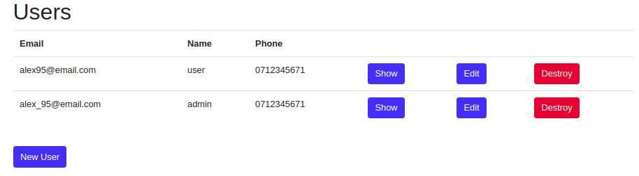

I developed a content management system application using Rails 5 used for: 

* generating PDF for gas verification of central heating systems,
* generating PDF for periodic technical verification form,
* managing customers

## Customer

Implemented CRUD operations for customers.

On the show page, we can manage customer's VTPs, gas verifications, addresses, combustion plants, and gas installations.

Implemented CRUD opperations for VTP.

Implemented VTP form(snippet)

Generated PDF after the form is completed(snippet)

Implemented CRUD opperations for gas veriffication  

Implemented gas veriffication form(snippet)

Generated PDF after the form is completed(snippet)

## Users

In this application, I added two types of users
  * Admin user
  * Normal user
  
As an admin, you can see and modify everything in the application

As a normal user, you can modify customers details, add and edit VTP and gas verification

**as an admin user**

**as a normal user**

## Analyzer

This is a tool used to verify the gas installation 

Implemented CRUD operations for analyzer

## Company

Company details 

