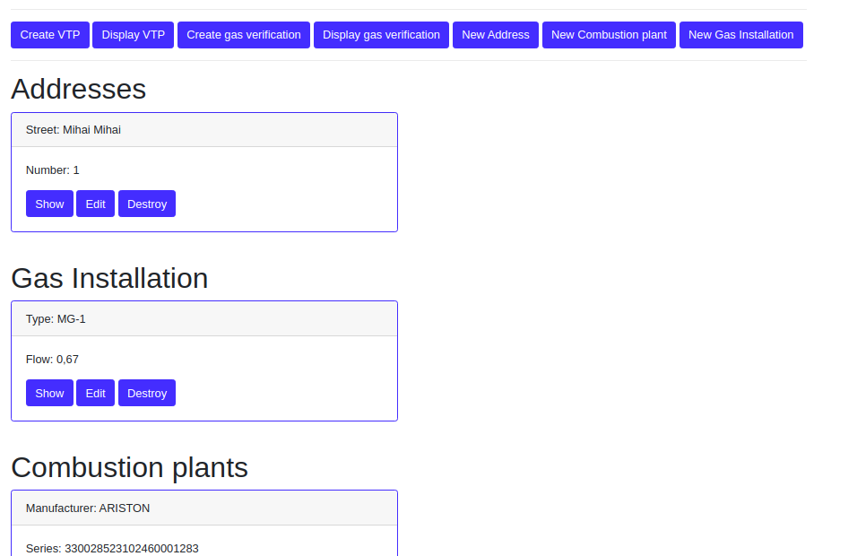

I developed a content management system application using Rails 5 used for: 

* generating PDF for gas verification of central heating systems,
* generating PDF for periodic technical verification form
* managing customers

The application was hosted on Amazon EC2 Instance

## Customer

CRUD operation for customers

On show page we can manage customer's VTPs, Gas verification, addresses, combustion plants and gas installations.

VTP CRUD opperations

VTP form

Gas Veriffication CRUD opperations

Gas Veriffication

